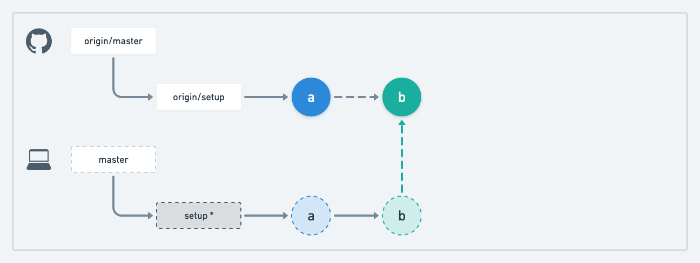

# Git Tutorial: WB1W2 Assignment

> The steps in this tutorial refer to the assignment's [README](https://github.com/Code-the-Dream-School/web-basics-1-week-2/blob/master/README.md)

### Step 3: Clone your repository on your machine

The `git clone` command creates a copy of a remote repository on your local machine. As you make changes within your local repository, you will need to sync those changes back to your remote repository to see them in GitHub (more on this later in Step 7b).

    git clone git@github.com:Code-the-Dream-School/web-basics-1-week-2-[your-username].git

### Step 4: Checkout a new branch in your local repository called "setup"

The `git checkout` command is used for switching your active branch (denoted by an asterisk) in your local repository. When you want to switch to a brand-new branch, you have to use the `-b` option which will create a new branch and then switch to it.

    git checkout -b setup

### Step 7a: Stage and commit your changes

To create a commit, you must first stage one or more changes. The `git add` command is used for staging changes; you can add all changes with the `-A` option or individual files/directories. The `git commit` command is used for creating a commit which is composed of a message and the change(s) that have been staged.

    git add -A
    git commit -m "message"

In the diagram below, "a" represents the commit that was just created.

### Step 7b: Push your local "setup" branch to your remote repository

The commit you just created will remain only in your local repository until you push it also to your remote repository. The `git push` command publishes commits from your local repository to your remote repository.

    git push origin setup

Not all branches are pushed at the same time, only the "upstream" branch. You can use the `--set-upstream` branch to change the upstream to your active branch (command below) or simply pass in the name of your remote and the name of the branch you want to push (command above).

> **Note:** once you set your "upstream" branch, you can run `git push` without needing to specify the branch name

    git push --set-upstream origin setup

### Step 10a: Stage and commit your changes

Each time you make changes to your local repository, you will need to repeat the steps of staging and committing those changes.

    git add -A
    git commit -m "message"

In the diagram below, "b" represents the commit that was just created.

### Step 10b: Push your local "setup" branch to your remote repository

Each time you are ready to push a new commit to your remote repository, you will need to run `git push`.

    git push origin setup

### Step 11a: Create a pull request from your setup to master

A pull request (PR) is a feature available in GitHub (not `git`) which allows you to review the file changes on a branch before merging it into another branch. This is helpful for when you want to receive feedback on your code.

As long as a pull request remains open, all the commits that you push to the associated branch will be added to it. This means if a reviewer suggests changes, you can push up additional commits to address that feedback within the same pull request.

For this assignment, you will create a pull request from `setup` to `master`:

1. Navigate to the "Pull Requests" tab in your repository
2. Click the "New pull request" button
3. Set the base branch to `master` and the compare branch to `setup`
4. Click the "Create pull request" button
5. (Optional) Add reviewer(s) in the "Reviewers" section

### Step 11b: Merge your pull request

Once your pull request has been approved, you can merge it by clicking the "Merge" button.

In the diagram below, "a" and "b" represent the commits from your `setup` branch and "c" represents the commit that is generated when you merge your pull request (this is called a "merge commit").

### Step 12a: Checkout the master branch in your local repository

As discussed in Step 4, the `git checkout` command is used for switching your active branch.

    git checkout master

In the diagram below, the active branch has been switched from `setup` to `master` (denoted by an asterisk).

### Step 12b: Pull changes from your remote repository

Opposite to Step 7b, any changes in your remote repository will remain there only until you pull them down to your local repository. The `git pull` command pulls commits from your remote repository down to your local repository.

    git pull

### Step 13: Check the status of your local repository

After all the steps above, your remote and local repositories should look similar to the diagram below. The `git log` command is used for checking the commits on the active branch in your local repository.

    git log --oneline

