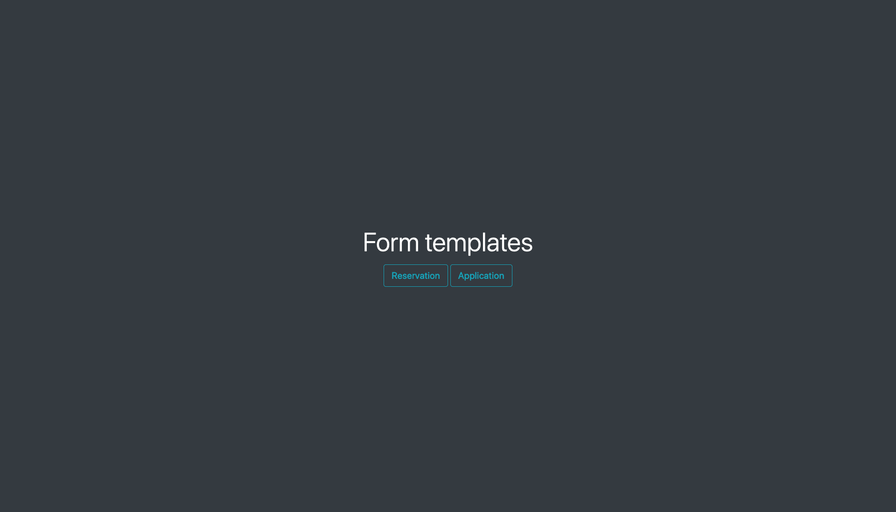
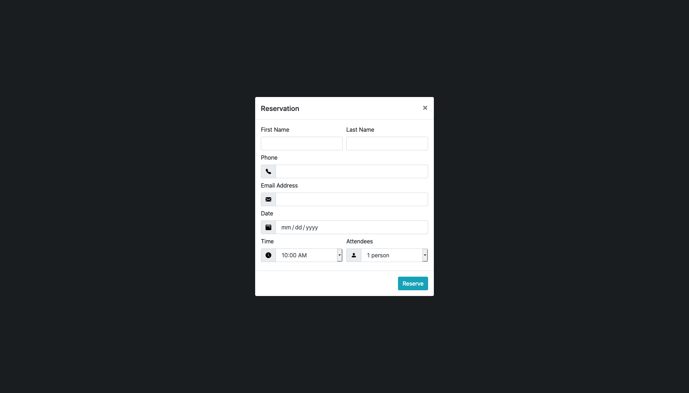
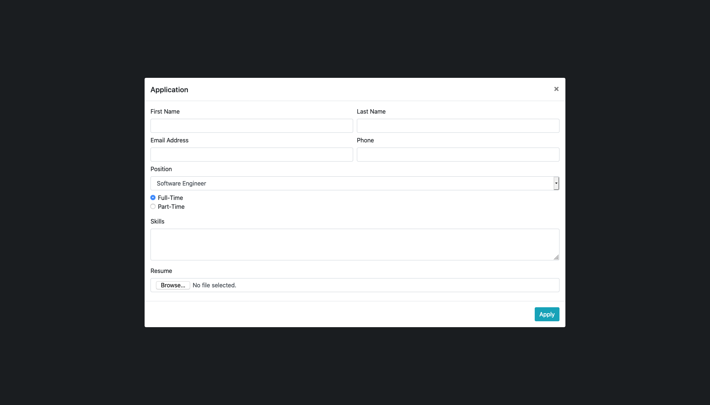

# Assignment Tips

## Requirements

> Based on the front-end 1 week 2 [assignment instructions](https://github.com/Code-the-Dream-School/Front-End-1-Week-3-Assignment/blob/master/F-1week3.pdf)

### Step 1: Create a "Landing" page



Turn the provided `index.html` file into a landing page for the form dialogs, containing the following elements:

- [ ] Large heading with text "Form templates"
- [ ] Button with text "Reservation"
- [ ] Button with text "Application"

<br/>
<br/>
<br/>
<br/>
<br/>
<br/>
<br/>

### Step 2: Create a "Reservation" form dialog



Add a "regular" modal component to the `index.html` file, containing the following elements:

- [ ] Title with text "Reservation"
- [ ] Text input with label "First Name"
- [ ] Text input with label "Last Name"
- [ ] Phone (tel) input with label "Phone" and icon
- [ ] Email input with label "Email Address" and icon
- [ ] Date input with label "Date" and icon
- [ ] Select menu with label "Time", icon, and options ranging from "10:00 AM" to "12:00 AM"
- [ ] Select menu with label "Attendees", icon, and options ranging from 1 to 20
- [ ] Submit button with text "Reserve"

<br/>

### Step 3: Create an "Application" form dialog



Add an "extra-large" modal component to the `index.html` file, containing the following elements:

- [ ] Title with text "Application"
- [ ] Text input with label "First Name"
- [ ] Text input with label "Last Name"
- [ ] Email input with label "Email Address"
- [ ] Phone (tel) input with label "Phone"
- [ ] Select menu with label "Position" and job-related options
- [ ] Radio button with label "Full-time"
- [ ] Radio button with label "Part-time"
- [ ] Textarea with label "Skills"
- [ ] File input with label "Resume"
- [ ] Submit button with text "Apply"

## Helpful Tips

1. [Use the Bootstrap "Starter Template"](#tip-1-use-the-bootstrap-starter-template)
2. [Leverage built-in JavaScript for modal triggers](#tip-2-leverage-built-in-javascript-for-modal-triggers)
3. [Use the Bootstrap "Input Group" component](#tip-3-use-the-bootstrap-input-group-component)
4. [Use the Bootstrap CSS instead of writing your own](#tip-4-use-the-bootstrap-css-instead-of-writing-your-own)
5. [Use the pattern attribute to validate phone input fields](#tip-5-use-the-pattern-attribute-to-validate-phone-input-fields)

### Tip 1: Use the Bootstrap "Starter Template"

You can use this template to ensure you have all the style and script files you need for the assignment:

https://getbootstrap.com/docs/4.5/getting-started/introduction/#starter-template

### Tip 2: Leverage built-in JavaScript for modal triggers

Bootstrap provides built-in JavaScript functionality which can be activated using the appropriate elements/attributes.

To get your "Landing" page buttons to trigger the "Reservation" and "Application" form dialogs, make sure to add a `data-target` attribute that matches the `id` of the modals.

> Learn more about [Bootstrap Modal Triggers](https://getbootstrap.com/docs/4.5/components/modal/#live-demo)

### Tip 3: Use the Bootstrap "Input Group" component

The assignment requires that you create a few input elements that have icons.

There is a built-in "Bootstrap" component called "Input Group" that you can use to achieve this result:

```html
<div class="input-group">

  <div class="input-group-prepend">
    <div class="input-group-text">
      
    </div>
  </div>

  <input type="date" class="form-control" />

</div>
```

### Tip 4: Use the Bootstrap CSS instead of writing your own

Bootstrap comes with many layouts, components, and utilities so you shouldn't need to write any CSS for this assignment.

### Tip 5: Use the pattern attribute to validate phone input fields

The `pattern` attribute is supported by `tel` (phone) input types and allows you to specify the regular expression pattern to be matched during form validation.

Example:

```html
<!-- format: 000-000-0000 -->
<input type="tel" pattern="[0-9]{3}-[0-9]{3}-[0-9]{4}" />
```

> Learn more about [input pattern attribute](https://developer.mozilla.org/en-US/docs/Web/HTML/Element/input/tel#pattern)

> Here's a resource for building and testing regular expressions: [https://regexr.com](https://regexr.com/)
