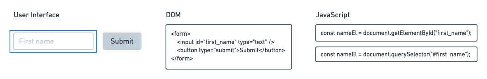
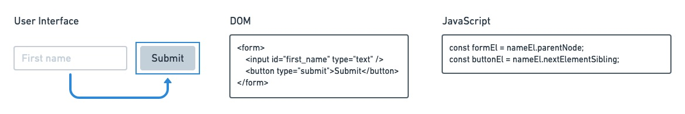
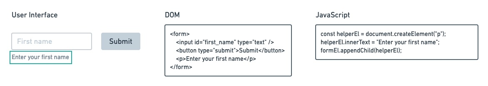
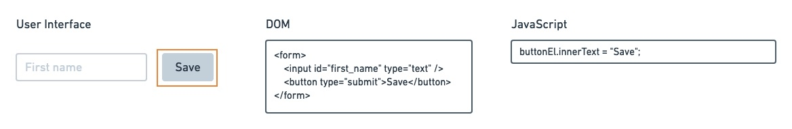
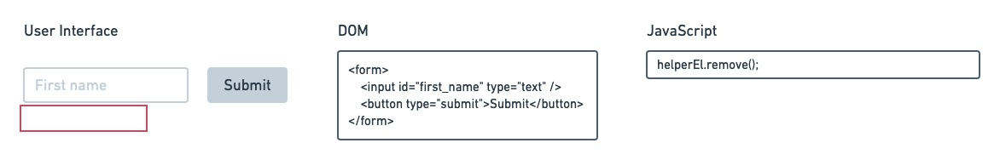
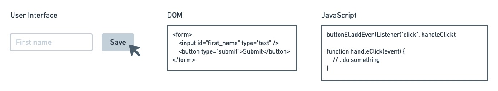

# Learning Objectives

## DOM Element Selection

Refers to selecting elements in HTML using JavaScript.

### Example:



```js
// Method 1: select using getElementById; OR
const nameEl = document.getElementById("first_name");
// Method 2: select using querySelector
const nameEl = document.querySelector("#first_name");
```

## DOM Traversal

Refers to moving up and down through the DOM using JavaScript.

### Example:



```js
const formEl = nameEl.parentNode; // traverse the DOM to find the parent element
const buttonEl = nameEl.nextElementSibling; // traverse the DOM to find the next sibling element
```


## DOM Manipulation

Refers to changing part(s) of an HTML element using JavaScript.

### Adding an Element

Example:



```js
const helperEl = document.createElement("p"); // create a new <p> element
helperEl.innerText = "Enter your first name"; // add text inside the new <p> element
formEl.appendChild(helperEl); // add the <p> element inside the <form>
```

### Modifying an Element

Example:



```js
buttonEl.innerText = "Save"; // change button text to "Save"
```

### Deleting an Element

Example:



```js
helperEl.remove(); // delete the <p> element that was added above
```


## Event Handling

Refers to handling events that happen in the UI using JavaScript.

### Types of events:
- `onchange`
- `onclick`
- `onmouseover`
- `onmouseout`
- `onkeydown`
- `onload`

> View full list of [DOM Events](https://developer.mozilla.org/en-US/docs/Web/Events)

### Example:



```js
// Method 1: pass a function reference; OR
buttonEl.addEventListener("click", handleClick);

function handleClick(event) {
  //...do something
}

// Method 2: pass an anonymous inline function; OR
buttonEl.addEventListener("click", function (event) {
  //...do something
});

// Method 3: pass an arrow function
buttonEl.addEventListener("click", (event) => {
  //...do something
});
```
